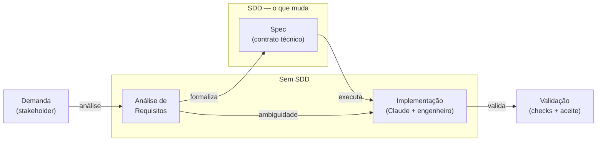

# SDD com Claude para Engenharia de Dados no Databricks


Repositório de artefatos, documentação e código para a apresentação de alinhamento sobre adoção de **Spec-Driven Development (SDD)** com Claude no contexto de engenharia de dados no Databricks. A proposta central: a IA gera produtividade real quando acoplada a padrão, contrato e review — não apenas quando escreve código mais rápido.

> **"Spec primeiro. Código depois."**

---

## Índice

*   [Proposta e Fluxo SDD](#proposta-e-fluxo-sdd)
*   [Diferenciais da Abordagem](#diferenciais-da-abordagem)
*   [Documentação Completa](#documentação-completa)
*   [Agentes Claude Prontos para Uso](#agentes-claude-prontos-para-uso)
*   [Specs de Exemplo](#specs-de-exemplo)
*   [Estrutura do Projeto](#estrutura-do-projeto)
*   [Decisões de Design](#decisões-de-design)
*   [Troubleshooting](#troubleshooting)
*   [Proposta de Piloto](#proposta-de-piloto)

---

## Proposta e Fluxo SDD

A spec é o elo que faltava entre análise de requisitos e implementação. Sem ela, a ambiguidade vai direto para o código.



| Etapa | Sem SDD | Com SDD |
| :--- | :--- | :--- |
| Pedido | Vago, sem contrato | Estruturado com grain, fonte e checks |
| Implementação | Começa na suposição | Começa no contrato |
| Review | Caro e tardio | Objetivo — valida contra a spec |
| Retrabalho | Alto | Reduzido desde o início |

---

## Diferenciais da Abordagem

*   **Spec como artefato central**: cada entrega começa com um contrato técnico, não com código.
*   **Contexto persistente**: CLAUDE.md, rules.md e memory.md padronizam o comportamento do Claude por repositório.
*   **Agentes especializados**: responsabilidades separadas por domínio — Databricks, API, tuning e qualidade.
*   **Fluxo multiagente controlado**: vários agentes coordenados pela mesma spec, sem perder governança.
*   **Piloto mensurável**: lead time, retrabalho e incidentes medidos com baseline via GitLab/Jira.
*   **Implementação via API**: além do Claude Code, agentes podem ser orquestrados via Anthropic API para pipelines automatizados.

---

## Documentação Completa

Para o conteúdo detalhado de cada slide e o roteiro completo, acesse o **[SUMMARY](./SUMMARY.md)**.

| Documento | Descrição |
| :--- | :--- |
| [Narrativa e Objetivo](./docs/narrative_plan.md) | Audiência, mensagem central, arco de slides e resultado esperado |
| [Roteiro por Sessão](./docs/roteiro_apresentacao.md) | Roteiro completo com numeração de slides e orientações do apresentador |
| [Spec Técnica do Deck](./docs/spec-apresentacao-sdd-databricks.md) | Como gerar, schema de slides, critérios de aceite |
| [Storyboard — Slide a Slide](./docs/storyboard-apresentacao-sdd-databricks.md) | Conteúdo completo dos 39 slides com kicker, título, cards e mensagem central |

---

## Agentes Claude Prontos para Uso

Copiar os arquivos para `.claude/agents/` no repositório do projeto e usar via `/agents` no Claude Code.

| Agente | Responsabilidade |
| :--- | :--- |
| [databricks-platform](./artefatos/agentes/databricks-platform.md) | Bundles, Lakeflow Jobs, pipelines declarativas, UC paths e deploy por ambiente |
| [api-backend](./artefatos/agentes/api-backend.md) | APIs de consulta, metadados, autenticação, contratos e documentação |
| [spark-tuning](./artefatos/agentes/spark-tuning.md) | Shuffle, skew, partições, merge, storage layout e custo de execução |
| [data-quality-reviewer](./artefatos/agentes/data-quality-reviewer.md) | Checks, impacto downstream, reconciliação, rollback e falhas silenciosas |

---

## Specs de Exemplo

Specs completas das quatro camadas do lakehouse para o domínio de pedidos — prontas para adaptar ao contexto real do time.

| Spec | Camada | Descrição |
| :--- | :--- | :--- |
| [spec-template](./artefatos/specs/spec-template.md) | — | Template em branco para novas specs |
| [spec-exemplo-raw-commerce-events](./artefatos/specs/spec-exemplo-raw-commerce-events.md) | Raw | Ingestão append-only de eventos transacionais (orders/items/payments) |
| [spec-exemplo-raw-dim-changes](./artefatos/specs/spec-exemplo-raw-dim-changes.md) | Raw | Ingestão de CDC de dimensões + snapshots seed |
| [spec-exemplo-bronze-commerce-events](./artefatos/specs/spec-exemplo-bronze-commerce-events.md) | Bronze | Parsing tipado, dedup por event_id e quarentena |
| [spec-exemplo-bronze-dimensions](./artefatos/specs/spec-exemplo-bronze-dimensions.md) | Bronze | SCD2 de customers/products/categories |
| [spec-exemplo-silver-orders](./artefatos/specs/spec-exemplo-silver-orders.md) | Silver | Pedidos consolidados por order_id, enriched com dimensão |
| [spec-exemplo-gold-orders](./artefatos/specs/spec-exemplo-gold-orders.md) | Gold | Agregações por cliente × moeda × data |

---

## Como gerar dados de exemplo

O pacote `faker-lakehouse` em [generator/](./generator/) produz dados realistas das 6 entidades do modelo. Saída em JSONL particionado, pronta para Auto Loader.

### 1. Instalação (uma única vez)

```cmd
cd generator
python -m venv .venv
.venv\Scripts\activate
pip install -r requirements.txt
pip install .
```

> Para contribuidores que querem rodar os testes: `pip install -e ".[dev]"` em vez dos dois comandos acima.

### 2. Configurar o `lakehouse.yaml`

Edite [lakehouse.yaml](./lakehouse.yaml) na raiz do projeto para ajustar volume, datas e taxas de falha:

```yaml
run:
  start: "2026-04-01"
  days: 7
  orders_per_day: 500
```

### 3. Gerar os dados

Com o venv ativo, a partir de `generator\`:

```cmd
faker-lakehouse seed     # popula data/seed/ com dimensões
faker-lakehouse run      # gera eventos conforme lakehouse.yaml
```

Override pontual via CLI (sobrescreve o YAML):

```cmd
faker-lakehouse run --orders-per-day 50 --days 1
```

Falhas realistas (late data, duplicatas, payloads corrompidos) são injetadas por padrão para justificar as regras de DQ e quarentena dos specs bronze. Ver [generator/README.md](./generator/README.md) para todas as opções.

Pequena amostra versionada disponível em [data/_sample/](./data/_sample/) para demos rápidas sem rodar o gerador.

---

## Estrutura do Projeto

```text
.
├── README.md                                        # Este arquivo
├── SUMMARY.md                                       # Sumário completo com links
├── docs/                                            # Documentação da apresentação
│   ├── narrative_plan.md
│   ├── roteiro_apresentacao.md
│   ├── spec-apresentacao-sdd-databricks.md
│   ├── storyboard-apresentacao-sdd-databricks.md
│   └── superpowers/                                 # Designs e planos de implementação
│       ├── specs/
│       └── plans/
├── artefatos/                                       # Prontos para uso no piloto
│   ├── agentes/                                     # Agentes Claude especializados
│   ├── specs/                                       # Templates e exemplos de spec
│   │   ├── spec-template.md
│   │   ├── spec-exemplo-raw-commerce-events.md
│   │   ├── spec-exemplo-raw-dim-changes.md
│   │   ├── spec-exemplo-bronze-commerce-events.md
│   │   ├── spec-exemplo-bronze-dimensions.md
│   │   ├── spec-exemplo-silver-orders.md
│   │   └── spec-exemplo-gold-orders.md
│   ├── memory/
│   ├── exemplos/
│   ├── guias/
│   ├── checklist-pr.md
│   └── metricas-piloto.md
├── generator/                                       # Gerador faker-lakehouse
│   ├── pyproject.toml
│   ├── faker_lakehouse/
│   └── tests/
├── data/                                            # Saída do gerador
│   ├── seed/                                        # Dimensões iniciais (gitignored exceto .gitkeep)
│   ├── landing/                                     # Stream de eventos (gitignored exceto .gitkeep)
│   └── _sample/                                     # Amostra versionada (1 dia, seed=42)
├── references/
├── build/
└── out/
```

---

## Decisões de Design

### Por que spec antes de código?
Sem um contrato técnico, o Claude — assim como qualquer engenheiro — começa na suposição. A spec define grain, fonte, alvo, incrementalidade e critério de aceite antes de qualquer linha ser escrita, reduzindo ambiguidade e retrabalho.

### Por que agentes especializados em vez de um agente geral?
Contexto longo degrada a qualidade da resposta. Agentes com responsabilidade única (tuning, qualidade, plataforma) mantêm o contexto enxuto e a saída mais precisa. O Claude Code gerencia a delegação automaticamente quando a `description` do agente está bem escrita.

### Por que separar CLAUDE.md, rules.md e memory.md?
Modularizar o contexto permite evoluir cada parte independentemente — regras operacionais mudam mais que as instruções base do projeto. O `@imports` do Claude Code carrega cada arquivo sob demanda.

### Por que medir lead time, retrabalho e incidentes?
Métricas cosméticas (linhas de código, velocidade de scaffolding) não provam valor real. Lead time captura o ciclo completo, retrabalho captura qualidade e incidentes capturam impacto operacional — os três juntos mostram se a adoção realmente melhorou o fluxo.

---

## Troubleshooting

| Problema | Causa | Solução |
| :--- | :--- | :--- |
| `Render/verify/fix loop cap reached` | Limite de 3 renders atingido na mesma sessão | `rm -rf build/tmp` e rodar novamente |
| `EBUSY: resource busy or locked` | PPTX aberto no PowerPoint | Fechar o arquivo e rodar novamente |
| `Warning: Ignoring extra certs` | Certificado ausente no ambiente | Ignorar — não afeta a geração do PPTX |
| Claude gera schema incorreto | Falta de CLAUDE.md ou spec no contexto | Adicionar CLAUDE.md ao projeto e referenciar a spec no prompt |
| Agente não é acionado automaticamente | `description` vaga no frontmatter do agente | Reescrever a description com gatilhos específicos de uso |

---

## Proposta de Piloto

*   **1 caso piloto** — preferir uma silver ou gold com dor real e escopo controlado
*   **4 artefatos base** — CLAUDE.md, spec-template, checklist-pr e agentes
*   **2 semanas** — janela de medição com comparação do fluxo anterior
*   **3 métricas** — lead time (GitLab MR open/close), retrabalho (rounds de review) e incidentes pós-deploy (rollback e quebra downstream)

---

*Apresentação: 24 de abril de 2026 · Preparado por Bruno Dias · NTT DATA*