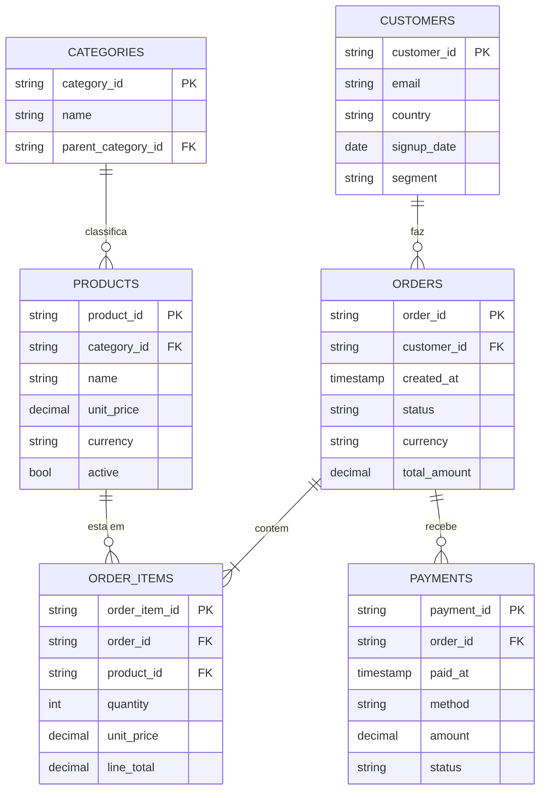

# Design — Faker Lakehouse: Modelagem e SDD End-to-End

**Data:** 2026-05-04
**Autor:** Bruno Dias (com brainstorming via Claude)
**Status:** Aprovado para implementação
**Escopo:** Modelagem da base de dados e-commerce, gerador de dados via biblioteca `Faker`, e specs revisadas das 4 camadas (raw, bronze, silver, gold) refletindo o novo modelo.

---

## 1. Contexto e Objetivo

O repositório `EntendimentoIAEngDados` é o material de apoio para a apresentação **SDD com Claude para Engenharia de Dados no Databricks** (24/abr/2026). Hoje os specs de exemplo (`spec-exemplo-raw-orders.md`, `bronze`, `silver`, `gold`) descrevem um cenário hipotético de eventos de pedidos sem fonte real concreta.

Este design entrega:

1. **Modelagem conceitual** de uma base de e-commerce com 6 entidades principais.
2. **Gerador `faker-lakehouse`** — pacote Python que produz dimensões iniciais (seed) e stream simulado de eventos transacionais com timestamps controlados, late data e falhas realistas, para servir como fonte concreta dos pipelines.
3. **4 specs revisadas** (raw → bronze → silver → gold) refletindo o novo modelo, substituindo as atuais. Forma um exemplo canônico coeso, demonstrando o ciclo completo de SDD em todas as camadas.

**Não-objetivos:**
- Implementação dos pipelines Databricks (próxima sessão, via plano gerado por `writing-plans`).
- Integração com Kafka/streaming real — apenas simulação via arquivos.
- UI ou dashboards consumindo a camada gold.

---

## 2. Modelo Conceitual

### 2.1 Entidades e relacionamentos



### 2.2 Perfis de mudança

| Entidade | Perfil | Geração |
|---|---|---|
| `categories` | Dimensão estável | Seed inicial; muda raramente |
| `products` | Dimensão SCD2 (preço/active) | Seed + ~1% mudam preço/dia |
| `customers` | Dimensão SCD2 (segment) | Seed + ~0,5% mudam segment/dia |
| `orders` | Fato/evento | Stream contínuo; ciclo de status |
| `order_items` | Fato/evento | Emitido junto com `order.created` |
| `payments` | Fato/evento | Emitido após `order.paid` |

### 2.3 Cardinalidades padrão (configuráveis)

- ~10 categorias (hierarquia em 2 níveis)
- ~80 produtos
- ~500 clientes (cresce ~1%/dia conforme novos cadastros)
- ~200 pedidos/dia, ~2,5 itens/pedido em média
- ~1,1 pagamentos/pedido (parciais e estornos)
- 3-5 eventos por pedido ao longo do tempo simulado

---

## 3. Gerador `faker-lakehouse`

### 3.1 Estrutura

```
EntendimentoIAEngDados/
├── data/
│   ├── seed/                                       # dimensões iniciais
│   │   ├── categories.jsonl
│   │   ├── products.jsonl
│   │   └── customers.jsonl
│   └── landing/                                    # stream simulado
│       ├── orders/_partition_date=YYYY-MM-DD/part-*.jsonl
│       ├── order_items/_partition_date=YYYY-MM-DD/part-*.jsonl
│       ├── payments/_partition_date=YYYY-MM-DD/part-*.jsonl
│       └── dim_changes/_partition_date=YYYY-MM-DD/part-*.jsonl
└── generator/
    ├── pyproject.toml
    ├── faker_lakehouse/
    │   ├── __init__.py
    │   ├── config.py            # cardinalidades, seeds, taxas de falha
    │   ├── dimensions.py        # gera categories/products/customers
    │   ├── events.py            # lifecycle de orders/items/payments
    │   ├── faults.py            # late data, duplicatas, payload corrompido
    │   └── cli.py               # entrypoint
    └── tests/
        └── test_generator.py
```

### 3.2 CLI

```
faker-lakehouse seed                                  # popula data/seed/
faker-lakehouse run --start 2026-04-01 --days 7       # gera 7 dias de eventos
faker-lakehouse run --start 2026-04-01 --days 7 \
    --seed 42 \
    --orders-per-day 200 \
    --late-data-pct 5 --late-data-window-h 72 \
    --duplicate-pct 1 --corrupt-pct 2
```

- `seed` é idempotente (reescreve os 3 arquivos com mesma seed).
- `run` é idempotente para a mesma `--seed` e mesmas datas (mesma sequência de eventos).
- Ambos suportam `--out-dir` para redirecionar saída.

### 3.3 Lifecycle de pedido

```
order.created  ──70%──>  order.paid  ──60%──>  order.shipped  ──90%──>  order.delivered
                              │                        │
                              └──3% refunded            └──5% cancelled (em qualquer estado)
```

Cada transição emite um evento separado com `event_type` correspondente. Pagamentos parciais geram múltiplos `payment.captured` para o mesmo `order_id`.

### 3.4 Envelope de evento (formato canônico)

```json
{
  "event_id": "550e8400-e29b-41d4-a716-446655440000",
  "event_type": "order.paid",
  "occurred_at": "2026-04-01T09:50:12.000Z",
  "received_at": "2026-04-01T10:23:45.123Z",
  "source": "faker-lakehouse",
  "payload": {
    "order_id": "ord_abc123",
    "amount": 199.90,
    "currency": "BRL"
  }
}
```

### 3.5 Injeção de falhas (default ligadas)

| Falha | Default | Comportamento |
|---|---|---|
| Late data | 5% | `received_at` deslocado pra frente em até 72h |
| Out of order | parte do late data | `paid` pode chegar antes de `created` |
| Duplicatas exatas | 1% | Mesmo `event_id` aparece 2x |
| Payload corrompido | 2% | JSON quebrado, campo obrigatório ausente, ou tipo errado |

Falhas justificam as regras de DQ e quarentena nos specs bronze/silver e tornam o exemplo realista.

### 3.6 CDC de dimensão

Mudanças de dimensão (preço, segment, active) são emitidas em `data/landing/dim_changes/` com envelope:

```json
{
  "event_id": "...",
  "event_type": "product.updated",
  "occurred_at": "...",
  "received_at": "...",
  "source": "faker-lakehouse",
  "payload": {
    "entity": "products",
    "entity_id": "prod_xyz",
    "changes": { "unit_price": { "from": 19.90, "to": 21.50 } }
  }
}
```

---

## 4. Specs Revisadas — Sumário das 4 Camadas

Cada spec abaixo terá arquivo próprio em `artefatos/specs/`. Aqui consta apenas o resumo arquitetural; o conteúdo detalhado é gerado na implementação.

### 4.1 Raw

**`raw.commerce_events`** — alvo unificado para eventos transacionais (orders + order_items + payments), discriminados por coluna `_entity`. Ingestão via Auto Loader sobre `data/landing/{entity}/`. Append-only, particionado por `_partition_date` e `_entity`. Schema: envelope canônico + metadados de ingestão. DQ mínima (campos obrigatórios + banda de volume). Substitui `spec-exemplo-raw-orders.md`.

**`raw.commerce_dim_changes`** — spec irmã para CDC de dimensões. Mesma estrutura, alvo separado para isolar eventos de dimensão de eventos transacionais. Novo arquivo `spec-exemplo-raw-dim-changes.md`.

### 4.2 Bronze

**`bronze.commerce_events`** — parsing tipado do `payload`, dedup por `event_id` mantendo o `received_at` mais recente, quarentena para registros com payload corrompido (`bronze.commerce_events_quarantine`). MERGE por `event_id` + `_entity`. Aceita late data até 7 dias.

**`bronze.dim_customers`, `bronze.dim_products`, `bronze.dim_categories`** — SCD2 sobre `raw.commerce_dim_changes` + seed inicial. Colunas `_valid_from`, `_valid_to`, `_is_current`. MERGE por `entity_id`. Especialmente útil pra mostrar SCD2 didaticamente.

### 4.3 Silver

**`analytics.silver.orders`** — 1 linha por `order_id` com último estado válido, enriquecido com customer e items agregados. Filtra fluxo até `paid`/`delivered`/`cancelled`. MERGE por `order_id`. Reconciliação diária com bronze. Substitui spec atual.

### 4.4 Gold

**`analytics.gold.orders_summary`** — agregações por `customer_id × currency × summary_date` (total_orders, total_revenue, avg_order_value). Particionado por `summary_date`, Z-ORDER em `customer_id`. Reconciliação tolerância 0% com silver. Substitui spec atual.

---

## 5. Entregáveis (Lista Concreta)

| Caminho | Ação |
|---|---|
| `generator/pyproject.toml` | criar |
| `generator/faker_lakehouse/{config,dimensions,events,faults,cli}.py` | criar |
| `generator/tests/test_generator.py` | criar |
| `data/seed/`, `data/landing/` | criar (com `.gitignore` exceto pequena amostra) |
| `artefatos/specs/spec-exemplo-raw-commerce-events.md` | criar (substitui `spec-exemplo-raw-orders.md`) |
| `artefatos/specs/spec-exemplo-raw-dim-changes.md` | criar |
| `artefatos/specs/spec-exemplo-bronze-commerce-events.md` | criar (substitui `spec-exemplo-bronze-orders.md`) |
| `artefatos/specs/spec-exemplo-bronze-orders.md` | remover |
| `artefatos/specs/spec-exemplo-silver-orders.md` | substituir |
| `artefatos/specs/spec-exemplo-gold-orders.md` | substituir |
| `artefatos/specs/spec-exemplo-raw-orders.md` | remover |
| `README.md` | atualizar (tabela de specs + seção "Como gerar dados de exemplo") |
| `docs/superpowers/specs/2026-05-04-faker-lakehouse-design.md` | este arquivo |

---

## 6. Ordem de Implementação

1. **Gerador `faker-lakehouse`** — fonte precisa existir antes dos pipelines.
2. **Specs raw** — `raw.commerce_events` e `raw.commerce_dim_changes`.
3. **Specs bronze** — eventos + 3 dimensões SCD2.
4. **Spec silver** — `analytics.silver.orders`.
5. **Spec gold** — `analytics.gold.orders_summary`.
6. **README** — atualizar tabela de specs e instruções de uso do gerador.

---

## 7. Critérios de Aceite do Design

- Modelo conceitual cobre os cenários didáticos esperados (joins, SCD2, MERGE, late data, quarentena, agregação).
- Gerador é idempotente para mesma seed (verificável por hash dos arquivos de saída).
- Specs revisadas são consistentes com o gerador (toda regra de DQ tem fonte de defeito injetável correspondente).
- Apresentação de 24/abr pode usar este conjunto como exemplo canônico ponta a ponta.

---

## 8. Riscos e Trade-offs

| Risco | Mitigação |
|---|---|
| Volume de arquivos pequenos pode pesar em demos rápidas | CLI permite `--orders-per-day` reduzido; default modesto (200) |
| `Faker` em pt_BR pode gerar dados não determinísticos sem seed | Seed obrigatória; CLI exige `--seed` ou usa default fixo (42) |
| 4 specs novas é trabalho considerável | Implementação será fatiada via plano gerado por `writing-plans` |
| `data/landing/` pode crescer fora de controle no git | `.gitignore` agressivo; commitar apenas amostra de 1 dia |
